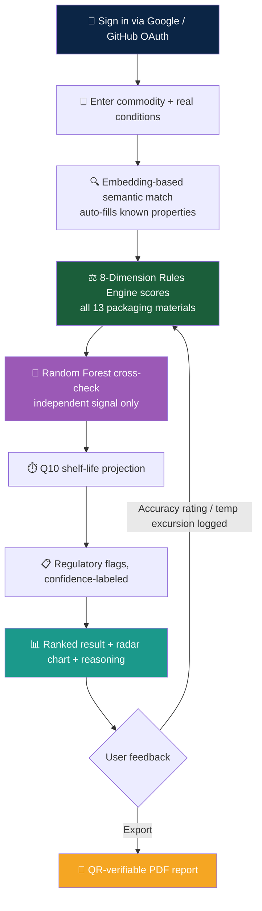

<p align="center">
  
  
  
  
  
  
  
</p>

<h1 align="center">📦 Wrapture</h1>

<p align="center">
  <strong>An Explainable AI System for Intelligent Food Packaging Recommendation</strong><br/>
  <em>Tell it a food product and its real storage and transport conditions. A rules-based scoring engine — not a black box —<br/>
  ranks the right packaging material, predicts shelf life, and shows its work on every single decision.</em>
</p>

<p align="center">
  <a href="#-why-this-exists">Why</a> •
  <a href="#-capabilities">Capabilities</a> •
  <a href="#️-system-architecture">Architecture</a> •
  <a href="#-decision-workflow">Workflow</a> •
  <a href="#-model--method-zoo">Model Zoo</a> •
  <a href="#-trust--reliability-engineering">Trust Engineering</a> •
  <a href="#-getting-started">Getting Started</a> •
  <a href="#-known-limitations">Limitations</a> •
  <a href="#-team">Team</a>
</p>

---

## 🎯 Why This Exists

Built for **Smart India Hackathon 2026**, Problem Statement **26236**, issued by the **Ministry of Food Processing Industries (MoFPI), Government of India**.

India loses a significant share of its fruits and vegetables every year to poor post-harvest handling — and one overlooked decision drives much of that loss: **what do we pack it in?** Today that choice sits between two domains that rarely share data — food science, which knows how a commodity degrades, and packaging engineering, which knows what a material can physically do. Without a shared, explainable layer between the two, most businesses pick packaging by habit, not evidence.

The problem statement asks for a system that closes that gap. So Wrapture is built around one non-negotiable design rule: **the ranking decision must always be explainable.** A rules-based scoring engine — not a hidden model weight — is the sole ranking authority for every recommendation Wrapture makes.

---

## ✨ Capabilities

<table>
<tr>
<td width="50%">

### 🎯 8-Dimension Rules-Based Scoring
Every one of 13 supported packaging materials is scored against a commodity's needs across **8 independent dimensions** — moisture barrier fit, cost, sustainability, recyclability, and more — covering **80+ commodities**. This engine, not the ML model, makes the final call.

</td>
<td width="50%">

### 🧠 Random Forest Cross-Check
A supervised **Random Forest** model, trained and validated with **GroupKFold cross-validation** to prevent commodity-level data leakage, scores each recommendation independently as a second opinion — surfaced for transparency, never allowed to override the ranking.

</td>
</tr>
<tr>
<td width="50%">

### ⏱️ Q10 Shelf-Life Kinetics
Shelf-life isn't a guess — it's computed with the **Q10 temperature-kinetics model**, a citable food-science formula that scales a commodity's baseline shelf life exponentially against the gap between a reference temperature and the actual entered storage temperature.

</td>
<td width="50%">

### 🔍 Embedding-Based Semantic Matching
Commodity lookup and FAQ matching run on **fastembed** (ONNX runtime) — migrated from a PyTorch-backed embedding model specifically to fit within free-tier memory limits, with the same checkpoint weights and zero measured regressions across a 37-query test set.

</td>
</tr>
<tr>
<td width="50%">

### 📋 Confidence-Labeled Regulatory Flags
Compliance considerations (resin codes, labeling norms) are flagged with an explicit **high-confidence vs. estimated** label. Guidance for the user to verify — never presented as certified compliance.

</td>
<td width="50%">

### 📊 Explainable Alternatives
A radar-chart comparison shows the top pick against close alternatives across all 8 dimensions at a glance, with honest reasoning for when an alternative genuinely differs from the top pick — no reused boilerplate text.

</td>
</tr>
<tr>
<td width="50%">

### 📄 QR-Verifiable PDF Reports
Every result exports as a server-generated **ReportLab PDF**, embedded with a QR code linking to a public verification page — anyone can scan and confirm authenticity, no account required.

</td>
<td width="50%">

### 🔄 Feedback Loop
Users can rate a recommendation's real-world accuracy or log an in-transit temperature excursion, triggering the scoring engine to **re-run and re-evaluate** the recommendation against the new conditions.

</td>
</tr>
<tr>
<td width="50%">

### 💬 Template-Based FAQ Assistant
A fast, embedding-matched Q&A widget for common questions — explicitly labeled as a template-based tool, **not** a general-purpose AI chatbot.

</td>
<td width="50%">

### 📱 Installable Progressive Web App
Installs as a real app on desktop and mobile via manifest + service worker, with API calls excluded from caching so data always stays live, and auto-updates on new deploys.

</td>
</tr>
</table>

---

## 🏗️ System Architecture

```
┌────────────────────────────────────────────────────────────────────────┐
│                           Wrapture Platform                            │
├────────────────────────────────────────────────────────────────────────┤
│                                                                        │
│  ┌──────────────────────────────────────────────────────────────┐    │
│  │            Frontend (React + Vite, deployed on Vercel)         │    │
│  │  ┌──────────┐  ┌───────────┐  ┌───────────┐  ┌─────────────┐  │    │
│  │  │  Sign-in │  │Recommend  │  │  Results  │  │  Library /   │  │    │
│  │  │  (OAuth) │  │   Form    │  │  + Report │  │  History     │  │    │
│  │  └────┬─────┘  └─────┬─────┘  └───────────┘  └─────────────┘  │    │
│  │       Installable PWA · Hindi/English · manifest + SW           │    │
│  └───────┼──────────────┼─────────────────────────────────────────┘    │
│          ▼              ▼                                              │
│  ┌──────────────────────────────────────────────────────────────┐    │
│  │                FastAPI Backend (Python 3.11, on Render)         │    │
│  │                                                                  │    │
│  │  ┌────────────────────────────────────────────────────────┐    │    │
│  │  │      Input Layer — commodity & condition validation       │    │    │
│  │  │   Embedding-based semantic match (fastembed / ONNX)       │    │    │
│  │  └──────────────────────────┬─────────────────────────────┘    │    │
│  │                             │                                    │    │
│  │  ┌──────────────────────────▼─────────────────────────────┐    │    │
│  │  │     8-Dimension Rules-Based Scoring Engine (SOLE          │    │    │
│  │  │              RANKING AUTHORITY — never overridden)         │    │    │
│  │  └────┬──────────────┬───────────────┬─────────────────────┘    │    │
│  │       ▼              ▼               ▼                          │    │
│  │  ┌─────────┐  ┌───────────────┐  ┌───────────────────────┐     │    │
│  │  │ Random  │  │  Q10 Shelf-   │  │   Regulatory Flagging  │     │    │
│  │  │ Forest  │  │  Life Kinetics│  │  (confidence-labeled)  │     │    │
│  │  │Cross-   │  │  Model (not   │  │                        │     │    │
│  │  │Check    │  │  ML — chem.)  │  │                        │     │    │
│  │  │(signal  │  └───────────────┘  └───────────────────────┘     │    │
│  │  │only)    │                                                    │    │
│  │  └─────────┘                                                    │    │
│  │                                                                  │    │
│  │  ┌────────────────────────────────────────────────────────┐    │    │
│  │  │        ReportLab QR-Verifiable PDF Generation             │    │    │
│  │  └────────────────────────────────────────────────────────┘    │    │
│  └────────────────────────────────────────────────────────────────┘    │
│                             │                                            │
│  ┌──────────────────────────▼─────────────────────────────────────┐    │
│  │                          Supabase                                │    │
│  │      Postgres · OAuth (Google/GitHub) · Row-Level Security       │    │
│  └────────────────────────────────────────────────────────────────┘    │
└────────────────────────────────────────────────────────────────────────┘
```

**Design principle:** the rules engine ranks — the ML model only cross-checks. This is what keeps every recommendation traceable to a specific rule and threshold instead of a hidden weight.

---

## 🔄 Decision Workflow



### End-to-end flow

```
Sign in (OAuth, no passwords)
    → Select/type commodity → auto-filled properties, low-confidence values flagged
    → Enter storage temp, transport time/distance, budget tier (+ Advanced Mode)
    → 8-dimension rules engine ranks all supported materials
    → Random Forest cross-check runs alongside, shown but never authoritative
    → Q10 kinetics model projects shelf life at the entered temperature
    → Regulatory guidance flagged with explicit confidence level
    → Result: top pick + radar chart + alternatives + plain-language reasoning
    → Optional: export QR-verifiable PDF, log accuracy/temperature feedback
```

---

## 🔬 Component Registry

| Component | Engine | Role | Status |
|:---|:---|:---|:---:|
| **Scoring Engine** | Custom rules-based, 8 dimensions | Sole ranking authority across 80+ commodities, 13 materials | 🟢 Active |
| **ML Cross-Check** | Random Forest (GroupKFold CV) | Independent secondary signal, never ranks | 🟢 Active |
| **Semantic Matcher** | fastembed (ONNX, torch-free) | Commodity + FAQ lookup | 🟢 Active |
| **Shelf-Life Model** | Q10 temperature-kinetics | Deterministic food-science projection | 🟢 Active |
| **Regulatory Flagging** | Rule-based lookup | Confidence-labeled compliance guidance | 🟢 Active |
| **PDF Report Generator** | ReportLab | QR-verifiable, publicly checkable | 🟢 Active |
| **FAQ Assistant** | Template + embedding match | Fast Q&A, explicitly not a chatbot | 🟢 Active |
| **Feedback Loop** | Rules engine re-invocation | Accuracy rating + cold-chain excursion re-scoring | 🟢 Active |
| **PWA Shell** | Manifest + service worker | Installable, offline-safe static caching | 🟢 Active |

---

## 🏆 Model & Method Zoo

### Rules-Based Scoring Engine

| Detail | Value |
|:---|:---|
| Type | Deterministic, rules-based — **not** a trained model |
| Coverage | 80+ commodities × 13 packaging materials |
| Dimensions scored | 8 (moisture barrier fit, cost fit, sustainability, recyclability, and more) |
| Role | **Sole ranking authority** — every score traces to a specific rule and threshold |

### Random Forest Cross-Check

| Detail | Value |
|:---|:---|
| Model | scikit-learn Random Forest |
| Validation | GroupKFold cross-validation (prevents commodity-level leakage between folds) |
| Role | Independent secondary signal, shown for transparency — **never used to rank** |

### Embedding-Based Semantic Matching

| Detail | Value |
|:---|:---|
| Runtime | fastembed (ONNX) — migrated from a PyTorch-backed model | 
| Reason for migration | `sentence-transformers` unconditionally loads torch (~180MB); free-tier memory required a torch-free path |
| Checkpoint | Same underlying embedding weights before and after migration |
| Verification | Zero regressions across a 37-query comparison; idle memory reduced from 639.4MB → 367.7MB |

### Q10 Temperature-Kinetics Model

| Detail | Value |
|:---|:---|
| Type | Established food-science formula — **not machine learning** |
| Function | Scales baseline shelf life exponentially against the gap between reference and actual storage temperature |

---

## 🛡️ Trust & Reliability Engineering

This is the section most hackathon teams skip. We didn't.

- **Ranking authority is fixed, always.** The rules engine ranks; the Random Forest model is cross-check-only and is never allowed to change or override the final recommendation — enforced in code, not just in messaging.
- **Confidence, not certainty, is labeled everywhere.** Auto-filled commodity properties flag low-confidence estimates instead of guessing silently. Regulatory flags carry an explicit high-confidence vs. estimated label. Nothing is presented as certified compliance.
- **Real measurement over assumption.** The fastembed migration wasn't shipped on the promise of lower memory — it was verified with actual before/after RSS measurements and a 37-query regression comparison before being trusted in production.
- **Honest tool labeling.** The FAQ Assistant is explicitly described as a template-based Q&A widget, not a general-purpose AI chatbot — because overselling a feature to judges is a risk we chose not to take.
- **No silent guessing.** Wherever the system isn't confident — an estimated commodity property, a regulatory flag, an ML cross-check disagreement — the UI says so instead of presenting a single, falsely confident number.

---

## 🚀 Getting Started

### Backend

```bash
cd backend
python -m venv venv
source venv/bin/activate        # Windows: venv\Scripts\activate

pip install -r requirements.txt
cp .env.example .env            # fill in Supabase URL/key, CORS origins
uvicorn main:app --reload
```

- API: `http://127.0.0.1:8000`
- Health check: `http://127.0.0.1:8000/health`

### Frontend

```bash
cd frontend
npm install
cp .env.example .env.local      # VITE_API_URL=http://localhost:8000
npm run dev
```

- App: `http://localhost:5173`

---

## 📂 Project Structure

```
Wrapture/
├── backend/
│   ├── app/
│   │   ├── main.py
│   │   ├── scoring/                  # 8-dimension rules engine
│   │   ├── ml/                       # Random Forest cross-check + GroupKFold training
│   │   ├── embeddings/               # fastembed-based semantic matcher
│   │   ├── shelf_life/               # Q10 kinetics model
│   │   ├── regulatory/               # confidence-labeled compliance flags
│   │   ├── reports/                  # ReportLab PDF + QR verification
│   │   └── routers/                  # auth, recommend, reports, health
│   ├── tests/                        # 290+ tests
│   └── runtime.txt                   # pinned Python 3.11.9
├── frontend/
│   ├── vercel.json                   # SPA rewrite rule
│   └── src/
│       ├── components/               # InstallAppButton, PwaInstallContext, etc.
│       └── pages/                    # Recommend, Results, Library, Sustainability, Traceability
└── README.md
```

---

## 📡 API Overview

Interactive docs at [`http://localhost:8000/docs`](http://localhost:8000/docs) once the backend is running.

| Method | Endpoint | Purpose | Auth |
|:---:|:---|:---|:---:|
| `POST` | `/recommend` | Run a packaging recommendation for a commodity + conditions | Required |
| `GET` | `/recommend/{id}` | Retrieve a past recommendation | Required |
| `GET` | `/recommend/history` | List past recommendations for the user | Required |
| `POST` | `/recommend/{id}/feedback` | Log accuracy rating or temperature excursion | Required |
| `GET` | `/reports/{id}/pdf` | Generate/download the QR-verifiable PDF report | Required |
| `GET` | `/verify/{qr_id}` | Public QR verification page | — |
| `GET` | `/faq` | Template-based FAQ Assistant query | Optional |
| `GET` | `/auth/google/login` / `/auth/github/login` | OAuth login | — |
| `GET` | `/health` | Liveness check (also pinged by uptime monitor) | — |

*(See `backend/app/routers/` for the current authoritative route list.)*

---

## 🧪 Testing

```bash
cd backend
pytest
```

**290+ automated tests** cover the scoring engine across all 8 dimensions, the Random Forest cross-check, the fastembed semantic matcher (including the 37-query zero-regression suite), and API contract/error handling.

---

## ☁️ Deployment

| Layer | Platform | Notes |
|:---|:---|:---|
| Frontend | Vercel | Root directory `frontend`; SPA rewrite via `vercel.json` |
| Backend | Render (Free tier) | Python pinned to `3.11.9`; memory optimized to fit the 512MB free-tier cap |
| Database / Auth | Supabase | Postgres + OAuth + Row-Level Security |
| Uptime | cron-job.org | Pings `/health` every 10 minutes to reduce free-tier cold starts |

---

## ⚠️ Known Limitations

We'd rather list these than have them surface as surprises during evaluation:

- The **15–20% post-harvest loss figure** referenced in our materials is a widely cited industry estimate — worth verifying against a specific ICAR-CIPHET or NABARD source before it's cited as fact in any formal submission.
- Regulatory guidance is informational and **not a substitute for formal compliance certification.**
- The commodity/packaging dataset is curated from public/domain sources for this hackathon submission — not a live, continuously updated industry feed.
- Render's free tier means brief cold-start delays are possible after inactivity, mitigated but not eliminated by uptime pinging.

---

## 👥 Team

<p align="center"><strong>Orbital Minds_133</strong></p>
<p align="center">Smart India Hackathon 2026 · Problem Statement 26236 · Ministry of Food Processing Industries</p>

---

<p align="center"><em>Built for judges who read the code, not just the demo.</em></p>
